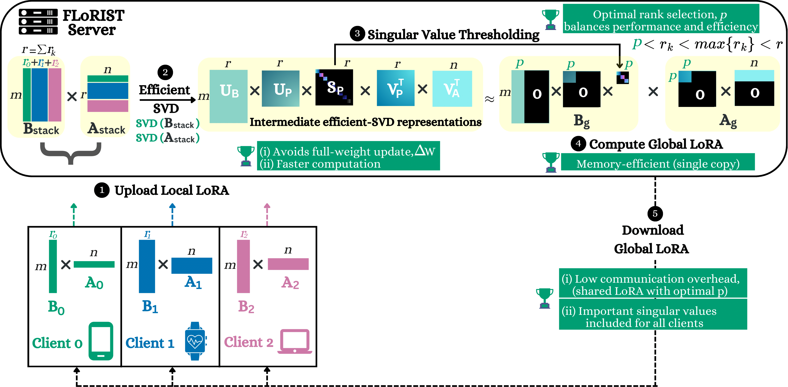

# FLoRIST: Singular Value Thresholding for Efficient and Accurate Federated Fine-Tuning of Large Language Models

Official implementation of **FLoRIST** , a federated fine-tuning framework that performs **low-rank aggregation in latent space** using **Singular Value Thresholding (SVT)** to achieve the best trade-off between accuracy and communication efficiency for large language models.

📄 Paper: *Accepted to MLSys 2026*
Code release accompanies the final camera-ready version.

---

## Overview

Federated fine-tuning of LLMs is challenging because:

* Clients are heterogeneous
* Communication is expensive
* Naive LoRA aggregation introduces noise
* Full SVD approaches are computationally infeasible
* Stacking adapters explodes communication

FLoRIST resolves all three axes:

> **accuracy × efficiency × scalability**

Instead of constructing the dense global update matrix, FLoRIST:

✔ Aggregates directly in the low-rank latent adapter space
✔ Performs efficient SVD without forming ΔW
✔ Applies singular value thresholding to remove redundancy
✔ Supports heterogeneous client ranks natively
✔ Broadcasts a unified compact global adapter

This yields:

* Higher MMLU accuracy
* 5×–350× communication savings
* 7× lower server compute vs FlexLoRA
* Stable performance under heterogeneity

---

## Key Contributions

* **Noise-free aggregation** without cross-term artifacts (unlike FedIT)
* **Efficient SVD pipeline** that avoids full matrix construction
* **Energy-based rank selection** via singular value thresholding
* **Adaptive per-layer rank compression**
* **Best accuracy–efficiency trade-off** across all baselines

FLoRIST consistently outperforms:

> FedIT · FFA-LoRA · FLoRA · FlexLoRA

across:

* TinyLlama
* Llama-3.2-1B
* Dolly / Alpaca / Wizard
* Homogeneous + heterogeneous settings

---

<p align="center">
  
</p>

---

## Experimental Setup (Paper Configuration)

All reported results follow the MLSys paper protocol:

* 100 total clients
* 10 clients sampled per round
* 75 communication rounds
* non-IID client data partitions
* LoRA applied to attention layers only
* Evaluation on 1,444-sample MMLU subset

### Homogeneous setting

All clients rank = 16

### Heterogeneous setting

Heavy-tail rank distribution:

* 40 clients → rank 4
* 20 clients → rank 8
* 20 clients → rank 16
* 10 clients → rank 32
* 10 clients → rank 64

This reflects realistic client capacity imbalance.

---

## Requirements

```bash
pip install -r requirements.txt
```

Tested on:

* PyTorch 2.x
* CUDA 12
* NVIDIA H100 / A100 GPUs

---

## Datasets

### Wizard

[https://huggingface.co/datasets/WizardLM/WizardLM_evol_instruct_70k](https://huggingface.co/datasets/WizardLM/WizardLM_evol_instruct_70k)
→ `./data_wiz/`

### Alpaca

[https://huggingface.co/datasets/tatsu-lab/alpaca](https://huggingface.co/datasets/tatsu-lab/alpaca)
→ `./data_alpaca/`

### Dolly

[https://huggingface.co/datasets/databricks/databricks-dolly-15k](https://huggingface.co/datasets/databricks/databricks-dolly-15k)
→ `./data/`

Each sample must contain:

```
instruction
input (optional)
output
```

---

## Training

### Homogeneous Training

```bash
python main.py \
  --global_model tinyllama \
  --data_path ./data \
  --num_clients 100 \
  --clients_per_round 10 \
  --num_communication_rounds 75 \
  --local_num_epochs 3 \
  --method florist \
  --threshold 0.90
```

---

### Heterogeneous Training

```bash
python main.py \
  --global_model tinyllama \
  --data_path ./data_wiz \
  --num_clients 100 \
  --clients_per_round 10 \
  --num_communication_rounds 75 \
  --local_num_epochs 3 \
  --method florist \
  --threshold 0.85 \
  --heter True
```

For FedIT / FFA:

```
--zero_padding True
```

---

## Methods

Available aggregation strategies:

```
florist   ← proposed method
flora
fedit
flex
ffa
```

---

## Threshold Selection

τ ∈ [0.80, 0.99]

Lower τ:

✔ smaller global rank
✔ higher communication efficiency
✔ stronger compression

Higher τ:

✔ maximal accuracy
✔ less compression

We select τ via binary search to match or exceed baseline accuracy.

SVT acts as a **regularizer** — filtering noisy client updates.

---

## Evaluation

Every run automatically evaluates:

* MMLU accuracy
* convergence curves
* communication efficiency
* adapter rank statistics

Communication efficiency is defined as:

> 1 / total parameters transmitted

Lower rank → higher efficiency.

---

## Results Summary

Across all experiments:

FLoRIST achieves:

* Best or second-best accuracy
* Highest communication efficiency
* Stable heterogeneous performance
* Lowest server compute among accurate methods

Key findings:

* Up to **349× less communication vs full fine-tuning**
* Up to **108× more efficient than FLoRA**
* ~7× lower server FLOPs vs FlexLoRA
* Adaptive rank compression per layer
* Intermediate layers require higher rank
* q_proj > v_proj intrinsic dimensionality

---

## Communication Cost

Example (TinyLlama, Wizard):

| Method      | Download (MB) |
| ----------- | ------------- |
| Full FT     | 2076          |
| FedIT       | 45            |
| FLoRA       | 45            |
| FFA         | 22            |
| **FLoRIST** | **8.4**       |

---

## License

Apache 2.0

---

## Contributing

We welcome:

* reproducibility scripts
* dataset loaders
* experiment tracking
* benchmark extensions

Open an issue before major changes.


